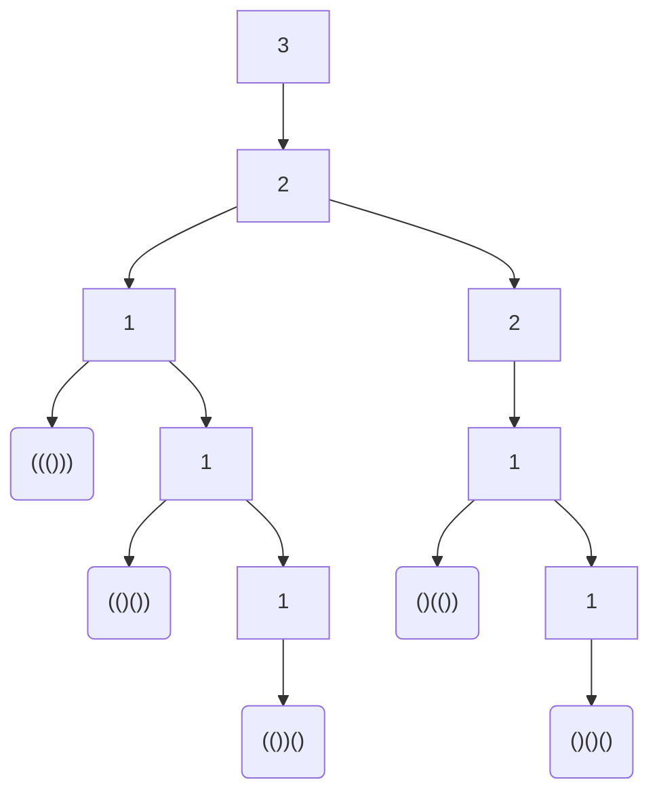

# Generate Parentheses (Leetcode 22)

Given n pairs of parentheses, write a function to generate all combinations of well-formed parentheses.

 

Example 1:
```
Input: n = 3
Output: ["((()))","(()())","(())()","()(())","()()()"]
```
Example 2:
```
Input: n = 1
Output: ["()"]
```

Constraints:
```
1 <= n <= 8
```

## Discussion

