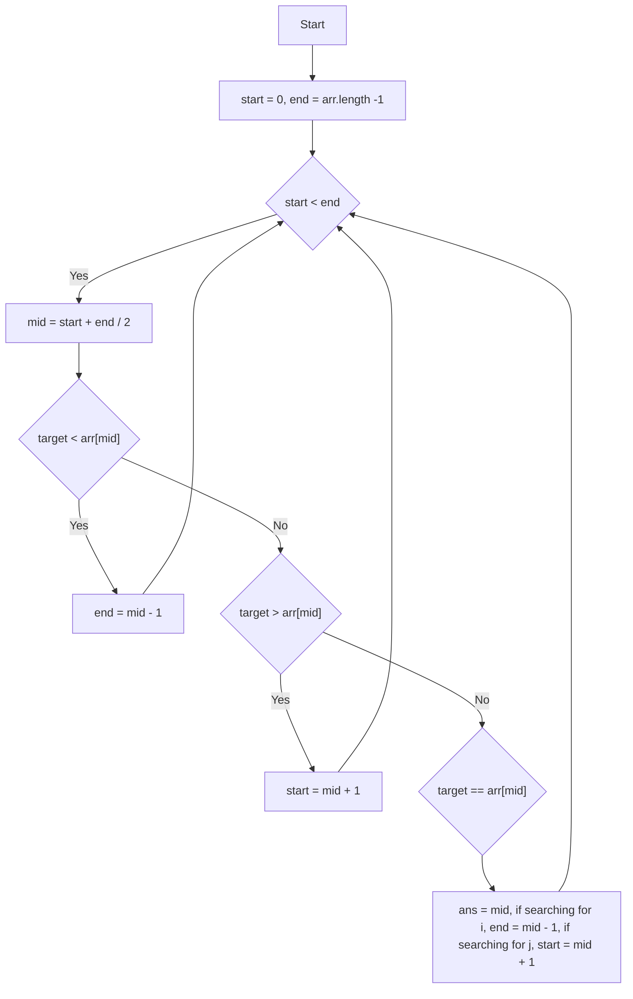

# Find First and Last Position of Element in Sorted Array (Leetcode 34)

Given an array of integers nums sorted in non-decreasing order, find the starting and ending position of a given target value.

If target is not found in the array, return [-1, -1].

You must write an algorithm with O(log n) runtime complexity.

Example 1:
```
Input: nums = [5,7,7,8,8,10], target = 8
Output: [3,4]
```
Example 2:
```
Input: nums = [5,7,7,8,8,10], target = 6
Output: [-1,-1]
```
Example 3:
```
Input: nums = [], target = 0
Output: [-1,-1]
```
```
Constraints:

0 <= nums.length <= 105
-109 <= nums[i] <= 109
nums is a non-decreasing array.
-109 <= target <= 109
```
## Discussions:
**target = 8**

|-          |0|1|2|3    |  4| 5 | ans|
|-          |-|-|-|-    |-  |-- |-   |
|-          |5|7|7|8    |  8|10 | -1 |
|iter1      |s| |m|     |   | e | -1 |
|iter2      | | | |s    |  m| e |  4 |
|iter3      | | | |s,m,e|   |   |  3 |
|**iter4**  | | |e|s    |   |   |  3 |


